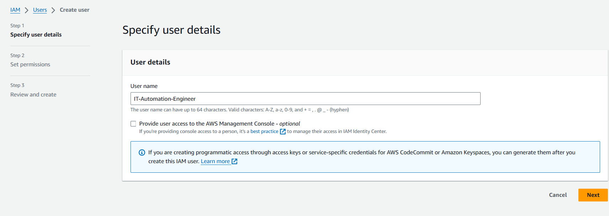

 Provision AWS Infrastructure for our project
 
1. Custom VPC creation 2. Create custom subnet (1 subnet and 3 AZ)   3.Create Routetable and internet gateway 4. Provision EC2 instance 5.Deploy Nginx Docker Container 6. Create security group (firewall)  

In these project we are going to provision an EC2 instance on AWS infrastructure

Run Nginx Docker container on EC2 Instance

IAM User creation :
-------------------
Search for IAM on top search icon of your AWs Management console

You will see screen like below 👇
and click on users on left side (marked ) to create new IAM user

click on `create user` button

Give some name of your choice for me, it is `IT-Automation-Engineer`

Let's create Access Keys

select CLI as use-case and confirm

Don't share these access keys with anyone. These are individual's personal.

